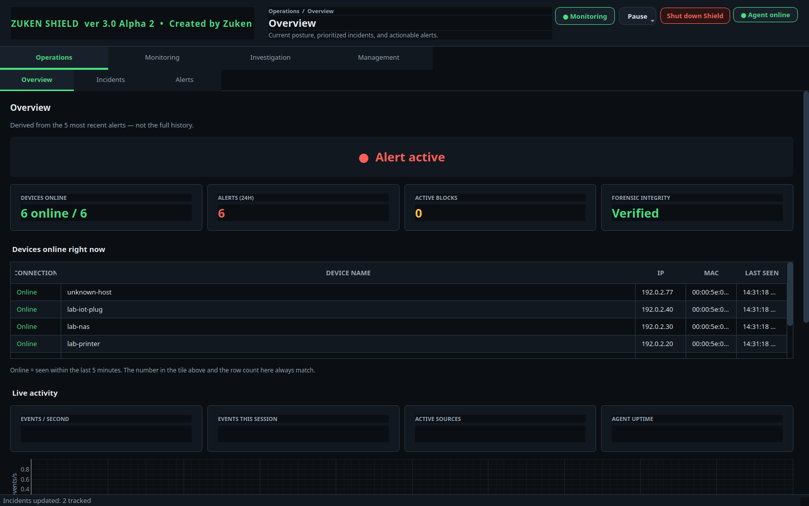
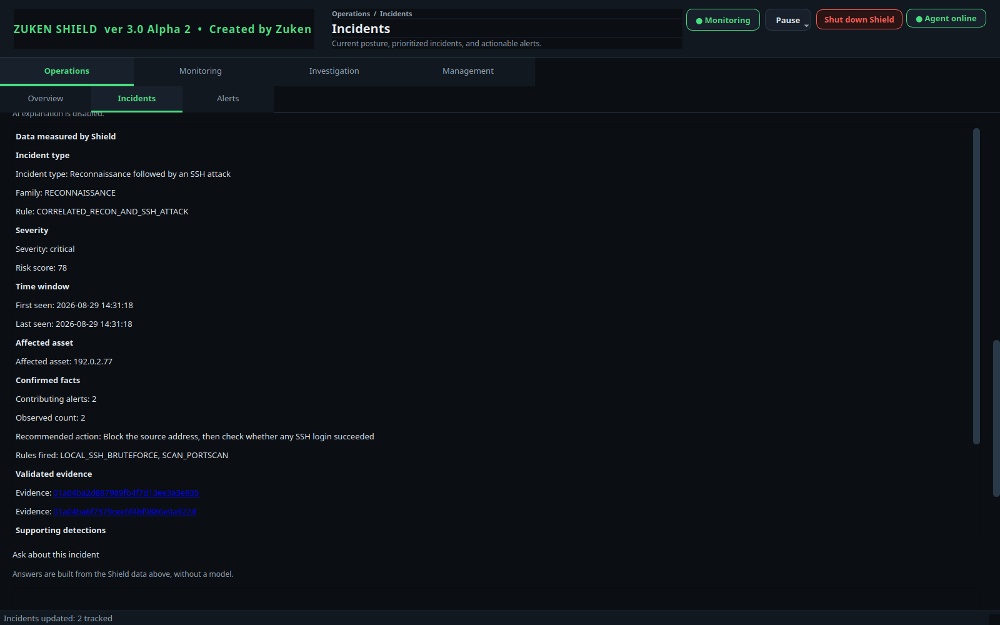
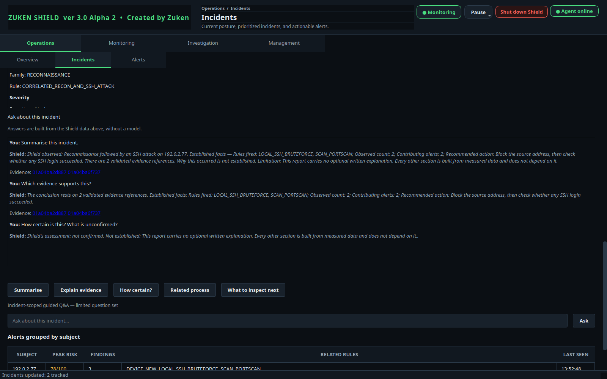
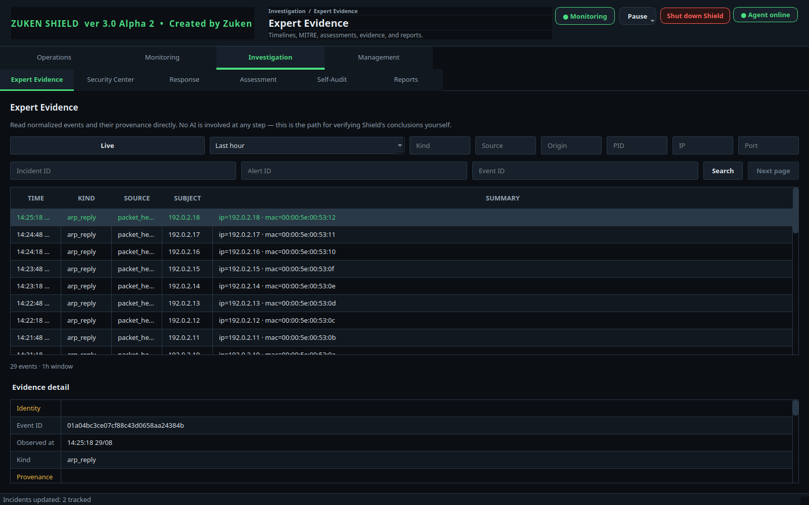
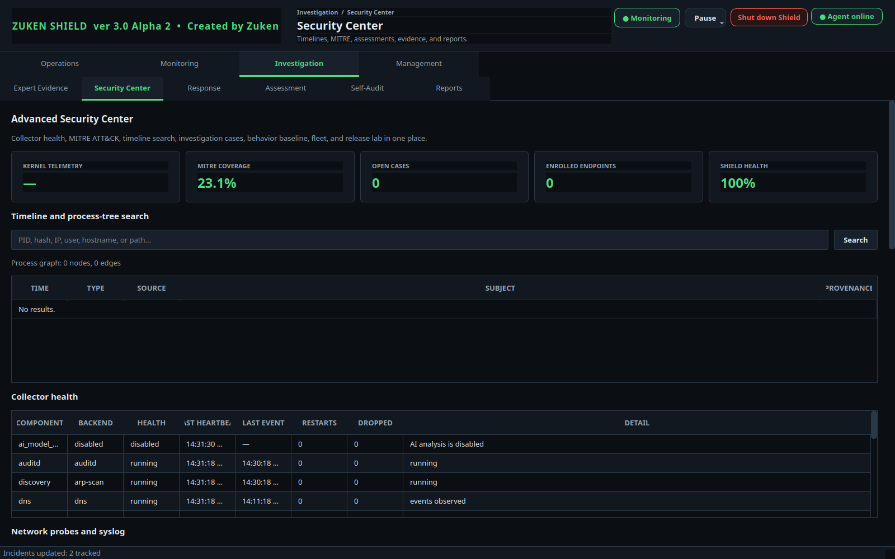
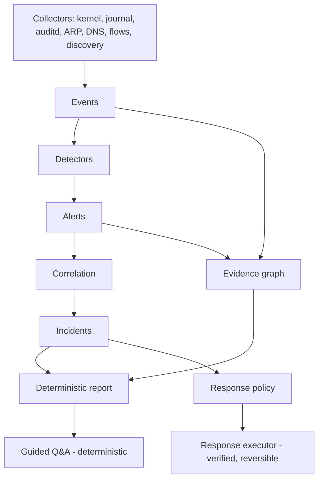

# Zuken Shield

An evidence-driven Linux security monitoring and investigation platform, built
for defensive monitoring, incident investigation, and authorised security labs.

Shield watches one Linux host and the local network around it, turns what it
observes into evidence-backed alerts, groups related alerts into incidents, and
produces an incident report where every statement can be traced to a stored
event.

---

## Beta 1.0

This is a beta. It runs, it is tested, and it is in daily use on the developer's
own machine — but it has not had an independent security review, and it has not
completed long-duration soak testing. Treat it as software you evaluate in a lab
you own, not as a product you place in front of something valuable.

Product release: **Beta 1.0**
Internal package version: **3.0.0a2** (this is what `dpkg` and `pip` report)

The two numbers are deliberately not merged; see `docs/RELEASE_NOTES_BETA_1.0.md`.

---

## What Shield does

Shield collects telemetry from the host and the local network, evaluates it
against detection rules, and preserves the evidence behind every conclusion.

- **Endpoint telemetry** — process execution, file writes, and outbound socket
  connections via eBPF/bpftrace where available, plus file-integrity monitoring,
  listening-socket inventory, USB device events, and journal/auditd ingestion.
- **Network telemetry** — ARP and neighbour observation, DNS resolver watching,
  connection and flow aggregation, device discovery, and traffic statistics.
- **Detection** — 58 rule identifiers across authentication, reconnaissance,
  malware-execution behaviour chains, network tampering (ARP/DNS/DHCP/ICMP),
  device inventory, file and configuration tampering, risky service exposure,
  and Shield's own integrity.
- **Correlation** — related alerts are grouped into incidents, including
  multi-step chains such as reconnaissance followed by an SSH attack.
- **Evidence graph** — 12 entity types and 11 relations, with the rule that no
  edge may exist without a valid evidence reference.
- **Deterministic incident reports** — ten fixed sections built only from
  measured data, with an explicit epistemic state (confirmed fact, supported
  hypothesis, unconfirmed, insufficient evidence). The report template reserves
  two optional prose slots for a future model; they are unused in Beta 1.0.
- **Guided incident Q&A** — five closed questions about an incident, answered
  deterministically from the report in roughly a millisecond.
- **Expert Evidence** — a read-only, bounded, audited query surface over the
  event store for examining what actually happened.
- **Response workflow** — six action types behind a policy engine, with
  preconditions, verification against observable system state, and rollback.
- **Self-monitoring** — a guardian service, a systemd watchdog, a forensic
  ledger, bounded database maintenance, and alerts when Shield's own collectors
  go quiet.

## What Shield does not do

- It is **not** an exploitation framework, a penetration-testing engine, or an
  offensive agent.
- It is **not** a vulnerability scanner. It observes; it does not probe you.
- It is **not** antivirus and it does not remove malware.
- It is **not** a SIEM. It monitors one host and its local network, not a fleet.
- It does **not** send anything off the machine. There is no cloud service, no
  telemetry upload, and no remote AI.
- It is **not** enterprise-ready. There is no multi-tenancy, no central
  management, and no support contract.

## Artificial intelligence — read this carefully

**Shield is not an AI product, and Beta 1.0 does not use a language model for
anything.**

- The guided incident Q&A is **fully deterministic**. All five answers are built
  from the incident's own measured data. No model is loaded, and none is needed.
- Detection, correlation, scoring, reporting, and response decisions are
  deterministic and have never depended on a model.
- The repository does contain infrastructure for running a **local** model in an
  isolated worker — a separate process, its own systemd scope with memory and
  CPU limits, no network, and a strict output validator. It is **dormant**: no
  feature in Beta 1.0 starts it.
- That infrastructure exists because a model was evaluated for one feature and
  **did not meet the quality bar**. The measurements are in the release notes.
- If a future release enables a model, it will be optional, local-only,
  off by default, behind an explicit opt-in, and unable to override a measured
  fact.

## Who is Shield for?

- **Students and home-lab users** — see real telemetry from your own machine and
  follow an alert through to the evidence behind it.
- **Detection engineers** — a working example of evidence-first detection, and a
  lab where you can check whether an expected alert actually fires.
- **Blue and purple teams** — generate an authorised action on one host and
  compare it against what Shield observed and preserved.
- **Incident responders and SOC analysts** — practise investigation on a system
  where every claim in a report has a traceable evidence reference.
- **Researchers** — a small, readable, deterministic codebase with a strict
  separation between measurement and interpretation.

Shield is a single-host tool. It is useful for learning, for lab validation, and
for watching one machine you care about. It is not a fleet product.

## What it looks like

Renders of the real interface against a **synthetic lab dataset** — addresses
from the documentation ranges, no production host. Every incident, report section and answer
on screen was computed by Shield's own pipeline. Full set and capture notes:
`docs/screenshots/README.md`.

**Overview** — posture, devices online, live activity.



**Deterministic incident report** — fixed sections built only from measured
data, with evidence references you can open.



**Guided incident Q&A** — five closed questions, answered from the report
without a model.



**Expert Evidence** — the bounded, audited read path for checking Shield's
conclusions yourself.



**Security Center** — collector health, ATT&CK coverage, and Shield's own
health.



## Architecture overview



Full detail, including the IPC boundary and the dormant AI path, is in
`docs/ARCHITECTURE.md`.

## Requirements

- **Ubuntu 26.04 LTS or newer** for the packaged install. This is not a
  preference: the interface needs PySide6, and `python3-pyside6.*` first appears
  in Ubuntu 26.04. Ubuntu 24.04 ships only PySide2 (Qt 5), so the `.deb`
  dependencies cannot be satisfied there. On 24.04 you can still run from a
  source checkout with `pip install PySide6`, but that gives up the offline,
  distribution-only install the package is built around.
- Python 3.10 or newer
- systemd (Shield ships as system services)
- root privileges for the agent; the desktop interface runs as your user
- Optional, for kernel telemetry: `bpftrace`
- Optional, for response actions: `nftables`

## Installation

The supported path is the Debian package:

```bash
git clone https://github.com/trannguyenkhoa2002-art/zuken-shield.git
cd zuken-shield
bash packaging/build-deb.sh
sudo apt install -y ./dist/shield-monitor_*_amd64.deb
```

The package installs the agent and the privileged helper as systemd services and
enables them. Installation is offline: it does not reach PyPI.

## Quick start

```bash
# Is the agent running?
systemctl status shield-agent

# Watch it work
journalctl -u shield-agent -f

# Open the interface
shield
```

Full walkthrough: `docs/QUICK_START.md`.

## Testing in a lab

`docs/TESTING_GUIDE.md` shows how to validate Shield on hardware you own, using
benign actions only — create a file, open a socket, attach a USB stick — and
what Shield should observe for each. `docs/DEMO_SCENARIOS.md` covers end-to-end
walkthroughs from telemetry to incident report.

**Only test systems you own or are explicitly authorised to test.**

## Security model

- The **agent** runs as root for kernel telemetry and other privileged host
  observations. It is confined by systemd (`MemoryMax=1G`, restricted
  capabilities), and it imports no packet-capture library.
- **Packet capture is optional and lives outside the agent.** It runs in the
  separate `shield-packet-collector` service, with a restricted capability set
  (`CAP_NET_RAW` and `CAP_NET_ADMIN` only), and feeds the core newline-delimited
  JSON over a Unix socket. The core validates every message against a closed
  schema and treats the helper as untrusted input. If the helper is absent or
  fails, the core keeps running and reports the affected capabilities as
  unavailable.
- The **privileged helper** is a separate service exposing a small, fixed set of
  operations over a Unix socket. The agent cannot run arbitrary commands.
- The **interface** runs as your user and talks to the agent over a Unix socket
  with a closed command set.
- **Evidence stays local.** The database, PCAPs, and snapshots live in
  `/var/lib/shield/`. Nothing is uploaded.
- **Response actions** are levelled, reversible where possible, verified against
  observable state, and rolled back on failure.
- **Secrets are redacted** before anything is stored or displayed.
- **Adversarial input is tested, not assumed.** The repository carries a
  red-team corpus of 21 payloads across 9 attacker-controlled surfaces and
  8 attack behaviours, plus secrets that must never leave the machine. It runs
  as part of the normal test suite.

More: `docs/SECURITY_MODEL.md` and `docs/PRIVACY.md`.

## Known limitations

- Single host. No fleet management, no central console.
- No independent security review yet. No 24h/72h/7-day soak results yet.
- Kernel telemetry depends on `bpftrace`; without it, process/file/socket
  visibility is reduced and Shield reports the reduced coverage rather than
  hiding it.
- Detection quality is measured on the developer's own environment. Your traffic
  will differ.
- The interface is Vietnamese and English only.
- Response actions beyond `block_ip` have had limited real-world exercise.
- Some scenarios are deterministic-report-only by design.
- A startup watchdog timing defect was identified during Beta 1.0 testing and
  fixed. The fix was verified across repeated service starts and a real cold
  boot with zero watchdog timeouts. That is evidence, not long-duration soak
  testing; see `docs/RELEASE_NOTES_BETA_1.0.md`.

## Roadmap

`ROADMAP.md`.

## Contributing

`CONTRIBUTING.md`. The short version: evidence first, no duplicate canonical
primitives, deterministic code is the authority, and every new public claim must
be backed by code and a test.

## License

Apache License 2.0 — see `LICENSE`.

Shield uses the system-provided PySide6 and Qt 6 packages under their
**LGPL-3.0** licensing option. Shield does not bundle or statically link Qt
libraries; they are ordinary system packages you can upgrade or replace.

Packet capture — the one component that needs GPL-2.0 scapy — ships as a
separate optional package, `shield-packet-collector`, running as its own program
in its own process. The core imports no GPL-licensed library, and a test in the
suite enforces that. See `NOTICE` for dependency and distribution details, and
for what that separation does and does not claim.

## Optional: packet capture

Shield core works on its own. Installing `shield-packet-collector` additionally
enables:

- ARP, DHCP, ICMP and NDP observation — and with it MITM and rogue-DHCP
  detection
- TCP handshake visibility, which port-scan detection consumes
- outbound DNS observation
- the live bytes-per-second traffic graph

Without it, Shield reports those capabilities as unavailable rather than
failing. Endpoint telemetry, file integrity, journal and auditd ingestion,
device discovery, correlation, the evidence graph, incident reports, guided Q&A
and the response workflow are unaffected.

```bash
bash packaging/build-packet-collector-deb.sh
sudo apt install -y ./dist/shield-packet-collector_*_all.deb
sudo systemctl enable --now shield-packet-collector
```

## Responsible use

Shield is a defensive tool. Run it on systems you own or are explicitly
authorised to monitor. Monitoring a network without authorisation is unlawful in
many jurisdictions. See `DISCLAIMER.md`.
