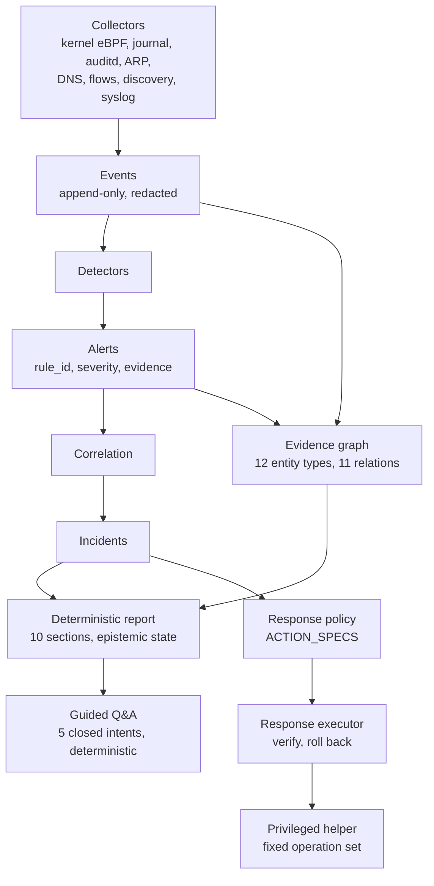
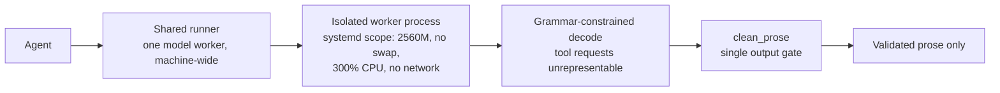

# Shield architecture

## Beta 1.0 pipeline



Each stage may only narrow what the previous stage established. Collectors state
facts and do not classify. Detectors classify and do not respond. The report
describes; it does not decide. Guided Q&A answers from the report and cannot
reach past it.

### Interface and agent

The desktop interface runs as an ordinary user and talks to the agent over a
Unix socket with a **closed command set** — a fixed list of named commands, each
validated, with everything else rejected. The interface renders what the agent
sends and decides nothing: scenario eligibility, epistemic state, and evidence
validity are all backend decisions.

```
shield (user)  ──unix socket──►  shield-agent (root)  ──unix socket──►  shield-privileged (root)
   renders                          decides                                fixed operations only
```

The interface is built on **PySide6** (Qt for Python) under the LGPL-3.0 option.

### Packet capture and the scapy boundary

Four collectors — `arp_sniffer`, `conn_watch`, `dns_watch`, `traffic` — import
scapy, and each import is function-local inside a `try/except ImportError`. When
scapy is absent the collector logs that it cannot start and returns; the agent,
detection, correlation, evidence graph, reports, guided Q&A, and response
workflow continue unaffected, with reduced network visibility.

That boundary is deliberate, and it is why moving these collectors into a
separate helper process would be a contained change: they take an event bus and
an interface name, and emit events. `probe/` is the existing precedent for such
a split — a separate package whose dependency boundary is enforced by a test.

### AI path — present, dormant in Beta 1.0

No feature in Beta 1.0 starts a model. The path is documented because the code
ships and will be used again.



`clean_prose` in `shield/report/template.py` is the only place generated text
becomes displayable. It drops any sentence inventing a value absent from the
canonical data, or claiming certainty Shield does not hold. There is exactly one
such gate on purpose; a second copy would drift from the first.

A model can never set severity, scenario, evidence references, counts,
identifiers, timestamps, or recommendations. In Beta 1.0 it writes nothing at
all, because guided Q&A is deterministic.

---

## Original design notes

Shield is evolving from a home-network monitor into a lightweight endpoint
security agent. The migration is incremental: existing collectors, detectors,
SQLite data and IPC clients remain compatible while new pipeline stages are
introduced behind stable models.

## Trust boundaries

1. **Collectors** describe facts as `Event`; they do not classify or respond.
2. **Detectors** turn events into `Alert` objects with evidence and playbooks.
3. **RiskScorer** assigns a deterministic 0–100 score and confidence value.
4. **PolicyEngine** makes the only automatic-response decision. The default is
   `audit_only=True`, so every result is `alert` even at score 100.
5. **Response adapters** execute only explicit, validated policy decisions.
6. **AI analysis** is read-only. It may summarize stored evidence but must never
   call a response adapter or write `policy_action`.

```text
                          ┌─ probe (mTLS)   trust=authenticated
log sources ──────────────┼─ syslog (raw)   trust=unauthenticated
                          └─ local collectors

collector -> Event -> detector -> Alert -> scorer -> policy -> store / IPC
                                     |        |                    |
                              correlation  RiskContext        response adapter
                                     |     (asset/repeat/intel)     |
                                 Incident                    DeadManSwitch
```

7. **Trust levels.** From 1.1, events carry `origin` and `trust`. Anything
   marked `unauthenticated` (raw syslog, which any host on the LAN can forge)
   never enters the forensic ledger, never exceeds `warning` severity, and
   never trains the behaviour baseline. `security/trust.py` is the single
   place those three boundaries are enforced.
8. **Guardian** runs outside the agent process, on a systemd timer. The agent
   cannot be the only thing watching the agent: `systemctl stop shield-agent`
   would otherwise remove the watcher along with the watched.

Every policy decision is written to `audit_log`. Automatic containment will
require all three conditions: audit-only disabled by an administrator, score at
or above the configured threshold, and the exact rule in an allowlist.

## Processes

| Process | Runs as | Purpose | Can act on the system? |
|---|---|---|---|
| `shield-agent` | root, group `shield` | collectors, detectors, IPC | yes, via the helper |
| `shield-privileged` | root | nftables / process control | yes, allowlisted actions only |
| `shield-guardian` | root, timer, `PrivateNetwork=yes` | verifies the agent is alive and untampered | **no**, read-only |
| `shield-ui` | the operator | PySide6 interface | no, sends commands only |
| `shield-probe` | root, on **other** machines | forwards that machine's logs | **no**, read-only |

The two read-only processes are read-only by construction, not by convention:
Guardian's unit denies every address family except `AF_UNIX`, and the probe
package contains no response code at all — a test asserts that it imports
neither scapy nor PySide6 and calls no process-control function.

## Data compatibility

`Alert` adds `risk_score`, `confidence`, and `policy_action` with safe defaults.
Older IPC payloads therefore still deserialize. `Store` performs additive
SQLite migrations with `ALTER TABLE`; existing alerts are retained and receive
default metadata.

## Delivery roadmap

- **Batch 1 — foundation (implemented):** deterministic scoring, audit-only
  policy, persisted decisions, risk visibility in the Alerts dashboard.
- **Batch 2 — endpoint telemetry (implemented foundation):** Linux process,
  listening-socket, systemd service and USB snapshots plus opt-in file integrity
  monitoring use `/proc`, `/sys` and bounded systemctl calls. Future work adds
  process ownership/capabilities and event-driven backends where available.
- **Batch 3 — detection (foundation implemented):** validated/versioned JSON
  rules, bounded correlation windows, persisted file-integrity baselines and
  explainable risk signals. Cryptographic rule signing remains part of hardening.
- **Batch 4 — response (safe foundation implemented):** PID-identity-checked
  process stop and file quarantine/restore use dry-run previews, expiring
  single-use approval tokens, allowlisted dispatch and audit logs. Existing
  firewall actions retain TTL rollback. Endpoint isolation applies a real
  nftables ruleset in its own `table inet shield_isolation`, reads the ruleset
  back from the kernel to verify the postcondition, and only then arms the
  dead-man switch. Before 2.0 it armed the switch and reported success without
  applying any rule at all. **Status: implemented and unit-tested; the
  network-namespace proof is opt-in and must be run with root.**
- **Batch 5 — intelligence and forensics (foundation implemented):** normalized
  IP/domain/hash indicators, provider timeouts and TTL caching; alerts, policy
  and response audits are mirrored to a hash-chained ledger with optional HMAC.
  External providers remain opt-in so endpoint data is never uploaded silently.
- **Batch 6 — extension and analysis (foundation implemented):** an offline,
  deterministic, read-only analyzer summarizes alerts after secret redaction.
  Plugins use versioned manifests, read/annotation-only permissions, bounded
  JSON input/output and timeouts. Plugins are disabled by default and remain
  trusted code; process isolation is defense-in-depth, not a security sandbox.
- **Batch 7 — hardening (baseline implemented):** bounded buses, retention,
  collector benchmarks, systemd filesystem/kernel hardening, forensic status in
  the dashboard and richer risk-aware reports. Signed configuration and fully
  unprivileged collector separation remain future defense-in-depth work.
- **Batch 8 — defensive assessment (implemented):** local-only profiles,
  in-memory simulation, explicit ground truth, per-test watchdog/cleanup,
  detector/risk/latency assertions, response-free replay, persisted sessions,
  rule coverage, JUnit/SARIF and optionally HMAC-authenticated evidence bundles.
  Real collector fidelity and privileged rollback remain VM/namespace gates.
- **Batch 9 — advanced endpoint specialization (implemented foundation):**
  optional fixed-program eBPF exec telemetry with explicit fallbacks, ATT&CK
  enrichment, ordered behavior chains, explainable local baselines, case and
  process-graph investigation, cross-filesystem quarantine, signed offline
  STIX intelligence, tamper/clock monitoring and certificate/RBAC fleet state.
  Endpoint isolation execution is implemented against nftables with
  postcondition verification (2.0 Batch P0); the disposable-VM rollback release
  test is still the gate for calling it production-proven.

## Log ingestion (1.1)

```text
other machine                        this machine
─────────────                        ────────────
journald ─┐
audit    ─┼─ probe ─ spool(disk) ─ mTLS ─> log_ingest ─> event bus
files    ─┘         (256 MB cap)              │
                                         fleet_endpoints
router/camera ── syslog UDP/TCP ──> syslog_server ─> event bus
                (allowlist, rate-limited)
```

Both doors are closed by default. `log_ingest` requires a server certificate,
a key and a client CA before it binds anything; `syslog_server` refuses to
start while its allowlist is empty and binds `127.0.0.1` unless told otherwise.

The probe spool never silently discards: on reaching its cap it drops the
oldest lines and writes a `probe_spool_overflow` record so the gap is visible.
A silent gap in an evidence trail is worse than a known one.

## Performance rules

Collectors must avoid unbounded queues, polling below a justified interval, and
synchronous network calls on the event loop. Expensive hashing is incremental,
threat-intelligence checks are cached, and overload drops low-priority telemetry
before security alerts. Each new collector must ship with a resource benchmark.

## Production security roadmap status

- IPC authenticates peers with `SO_PEERCRED`, bounds messages/rates, rejects
  request replay and returns sensitive response tokens only to the requester.
- A minimal privileged helper protocol exists for firewall and PID-identity
  process response. Migration of all root collectors out of the coordinator is
  staged because disabling them prematurely would remove protection.
- Linux Audit/journald supplies event-driven exec and protected-file telemetry;
  `/proc` remains a portable fallback.
- The UI groups findings into incidents and uses two-step response confirmation.
- Rule/update signature verification and external forensic checkpoints are
  available. Production deployments should require keys rather than accepting
  unsigned development rule packs.
- Root network-namespace and VM test harnesses are opt-in and refuse accidental
  workstation execution.

## UI principles

The dashboard presents status first, then actionable findings. Alert severity
and risk are separate: severity is the rule classification; risk combines it
with available evidence. Destructive buttons always show target, impact and a
confirmation step. Advanced network and defensive tools remain outside the
primary incident workflow.

## Response truthfulness (2.0 Batch P0)

The rule this batch enforces, and the reason the isolation path was rewritten:

> No response may return `ok=True` unless its postcondition has been verified
> against real system state.

Applied to endpoint isolation, that means the following order is mandatory and
is enforced by tests:

```text
ResponseExecutor
  -> PrivilegedClient            (no helper -> refuse, never fake success)
  -> allowlisted isolate_endpoint
  -> snapshot the pre-change ruleset
  -> nft -f -   (one atomic transaction, own table)
  -> nft -j list table inet shield_isolation
  -> verify: both hooks policy drop, loopback kept, management address accepted
  -> on verification failure: delete the table and return failure
  -> arm the dead-man switch only now
```

Three separate places used to claim success without changing system state, and
all three are fixed:

1. `isolate_endpoint` armed the dead-man switch and returned "isolated" without
   touching the firewall.
2. The dead-man expiry loop called `unblock_ip` on the **management** address —
   an address that was never blocked. The command always succeeded, always
   wrote an "isolation lifted" audit entry, and never lifted anything.
3. An agent that crashed between applying rules and persisting the deadline left
   an orphaned isolation that nothing would ever remove.
   `reconcile_isolation_on_start` now treats the kernel, not the agent's own
   state file, as the source of truth.

Policy (`shield/security/policy.py`) is wired but deliberately stops at a
`ResponseProposal`: every proposal carries `requires_human=True` in Phase 0, and
no code path reads a proposal and executes it.

Since Phase 4 there is a durable execution path — see "Trust boundaries in 2.0"
below — but the gate on it did not move. An action only runs automatically if it
is Level 2 or below, reversible, allowlisted in a **signed** configuration, and
raised by a detector whose precision has actually been measured. No detector has
been calibrated yet, so nothing runs automatically today.

## Trust boundaries in 2.0

Every arrow below is a schema boundary, validated at both ends. The ordering is
the whole design: each stage may only read from the stage above it, and the
stages that can change the system are the last two.

```text
Collectors (root, untrusted input)
        |
        v
Normalizer + trust classifier          origin and trust are stamped here, by the
        |                              server — never taken from the payload
        +--> Event store / forensic ledger
        |
        v
Detectors + evidence graph builder     no edge without a valid evidence ref
        |
        v
Read-only investigation API            hard limits, timeouts, redaction, audit
        |
        v
AI analyst (untrusted output)          bounded read-only tools, capability token
        |
        v
Evidence validator                     downgrades unsupported claims
        |
        v
Deterministic policy enforcement       action IDs only, from a source allowlist
        |
        v
Durable response queue                 13-state machine, idempotent, recoverable
        |
        v
Privileged helper                      tiny RPC surface, UID-checked
        |
        v
Independent verifier / rollback        reads observable state, not messages
```

### `shield/evidence` — the graph (Phase 1)

`Event` carries a unique `event_id`, both an event time and an ingest time, its
origin, its trust, and a content hash. `resolver.py` turns one event into
entities and edges; it is a pure function with no I/O, so the whole semantics of
the graph is testable without a database and two machines observing the same
thing build the same graph.

The invariant that makes the graph worth trusting: **an edge cannot exist
without at least one evidence reference**, and writing an edge whose evidence
does not resolve is refused at write time, not cleaned up later. Events are not
duplicated into an evidence table — `events` is the single source of truth, so
when retention deletes an event, every edge that depended on it becomes an
orphan immediately and is pruned.

Edges keep the trust of the evidence that created them and never inherit trust
from the entities at either end. This is what stops a forged syslog line from
gaining the trust level of a locally observed host by naming it.

`queries.py` is the only read surface. It accepts no SQL — callers pick a method
and pass parameters — and every query has a hard limit, a timeout, redaction and
an audit entry. Multi-hop traversal will not expand through a hub node, because
on a real machine the local `host` entity touches almost every edge and walking
through it turns "what is this process related to" into "everything that ever
ran here".

### `shield/ai` — the analyst (Phase 2)

The package cannot import `shield.privileged`, `shield.security.response`,
`shield.security.policy`, `shield.security.rules`, `shield.security.scoring` or
`shield.response`. That is checked by parsing the AST, not by grepping, and it
fails the build if it ever becomes untrue.

Model output is a strict schema. Unknown fields are refused rather than ignored,
because ignoring them silently is how an extra `"policy_action": "isolate"`
would go unnoticed. There is no `confirmed` status and no numeric probability
field. `statement_key` — the field a deterministic producer uses to emit a
translation key — is internal and cannot be set by a model: letting a model pick
an i18n key would let it pick any string in the interface.

Everything the model reads goes through a capability token bound to one
incident, with a short TTL and a call budget. The model never sees the token.

`shield/ai/audit.py` persists what happened: the investigation, each claim, the
evidence each claim points at, every tool call, and every provider run including
the ones that failed. Traces expire in 14 days, records in 180 — when the
analysis is wrong, the hard question is not what it said but what it had seen.

### `shield/decision` — separated scores (Phase 3)

Four different questions had been collapsed into one number:

| Concept | Question it answers |
|---|---|
| `severity` | How bad would this be if real? |
| `risk_score` | How urgently should a person look? |
| `evidence_strength` | How rich and independent is the evidence? |
| `detector_precision` | How often has this detector actually been right? |

The last one exists only once a **person** has labelled outcomes, and stays
`None` below 20 labels. `None` means unknown; it is not filled in with a
plausible default. An uncalibrated detector is never allowed to act
automatically.

Decisions are content-addressed: the same input and configuration always produce
the same `decision_id`, so a disputed decision can be replayed from the audit log
months later. AI proposes an action ID and nothing else — TTL, blast radius,
preconditions and the rollback plan are looked up from a table in the source.

### `shield/response` — durable work (Phase 4)

A 13-state machine on disk, because every interesting state is one the agent can
die in. Transitions are transactional and the history is append-only; commands
carry an idempotency key enforced by a database `UNIQUE` constraint, not by a
check-then-insert that two processes can race through.

Adapters must provide all five of `preview`, `check_preconditions`, `apply`,
`verify` and `rollback`. `verify()` reads observable system state — the executor
never treats its own success message as evidence. A failed rollback is a critical
incident raised outside the agent, because it leaves a firewall rule nobody will
remove.

Four actions are implemented: `snapshot_state` (Level 1), `rate_limit_ip` and
`block_ip` (Level 2), and `isolate_endpoint` (Level 3, always human-approved).
`stop_process` deliberately has no adapter: it cannot be undone, and 2.0 does not
automate anything it cannot undo.

### `shield/evals` — measuring instead of asserting (Phase 3.2 and 5.5)

Two versioned corpora. The detection corpus covers 11 required categories from
normal administration to poisoned intelligence; the red-team corpus covers 9
attacker-controlled surfaces and 8 attack behaviours plus 7 secrets that must
never leave the machine. Both run against the **real** detectors on every commit
— a measurement that runs only when someone remembers runs exactly once, just
before release.

### Two kill switches, deliberately separate

`SHIELD_AI_KILL_SWITCH` stops every tool call from the analysis layer.
`SHIELD_RESPONSE_KILL_SWITCH` stops new response actions from being applied. Both
are read fresh on every check and survive a restart.

Neither touches detection, and the response switch deliberately does **not**
block rollback or crash recovery: a safety switch that also blocked the way out
would freeze every applied firewall rule in place, and the person pressing it to
stop the damage would cause more.
